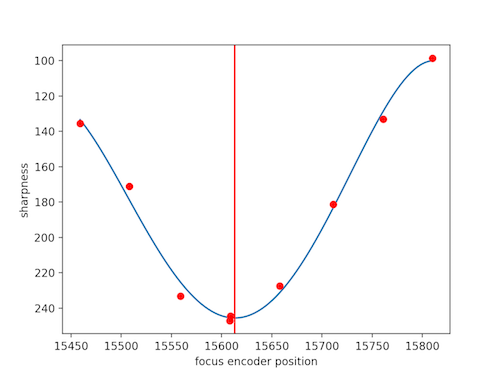

# calcFocus
script for calculating focus encoder position for best sharpness, for a given FITS files. 



## Usage CLI

- ```calFoc.py <fits_path> [options]``` - cli 
- ```plotFocus.py <fits_path> [options]``` - to plot result 

### Arguments

- `<fits_path>`: The path to the FITS files directory or a list with FITS files. **(required)**

### Options

- `focus_keyword=<keyword>`: FITS file header keyword to retrieve focus encoder position. Default: "FOCUS".
- `focus_list=<values>`: A list of focus values to use for the calculation. If None, the focus values will be extracted from the FITS header. Defaults to None.
- `crop=<pixels>`: The amount of pixels to crop from the edges of each image. Defaults to 10.
- `method=<method>`: The method to use for calculating sharpness. Can be "rms", "rms_quad". Defaults to "rms_quad".

### Returns

- `FOCUS`: focus encoder value for maximum sharpness
- `POLY COEFF`: coefficients for the polynomial fit used to calculate sharpness.

## Usage PACKAGE

### Function Name

`calculate_focus_position(fits_path, focus_keyword='FOCUS', focus_list=None, crop=10, method='rms_quad')`

### Parameters

- `fits_path` (str): The path to the FITS files directory or a list with FITS files.
- `focus_keyword` (str, optional): FIST file header keyword to retrieve focus encoder position. Default: "FOCUS".
- `focus_list` (list or None, optional): A list of focus values to use for the calculation. If None, the focus values will be extracted from the FITS header. Defaults to None.
- `crop` (int, optional): The amount of pixels to crop from the edges of each image. Defaults to 10.
- `method` (str, optional): The method to use for calculating sharpness. Can be "rms", "rms_quad". Defaults to "rms_quad".

### Returns

A tuple of two elements:

- `ax_sharpness_focus`: focus encoder value for maximum sharpness.
- `calc_metadata`: Dictionary of metadata with the following keys:
  - `poly_coef`: A NumPy array of coefficients for the polynomial fit used to calculate sharpness.
  - `focus_values`: A list of focus values used for the calculation.
  - `sharpness_values`: A list of corresponding sharpness values for each focus value.

### Examples

```python
# Example usage
ax_sharpness_focus, calc_metadata = calculate_focus_position('/path/to/fits/files', focus_keyword='FOCUS', crop=20)
```

### Libraries:

Python3  
Astropy  
NumPy   
matplotlib  


